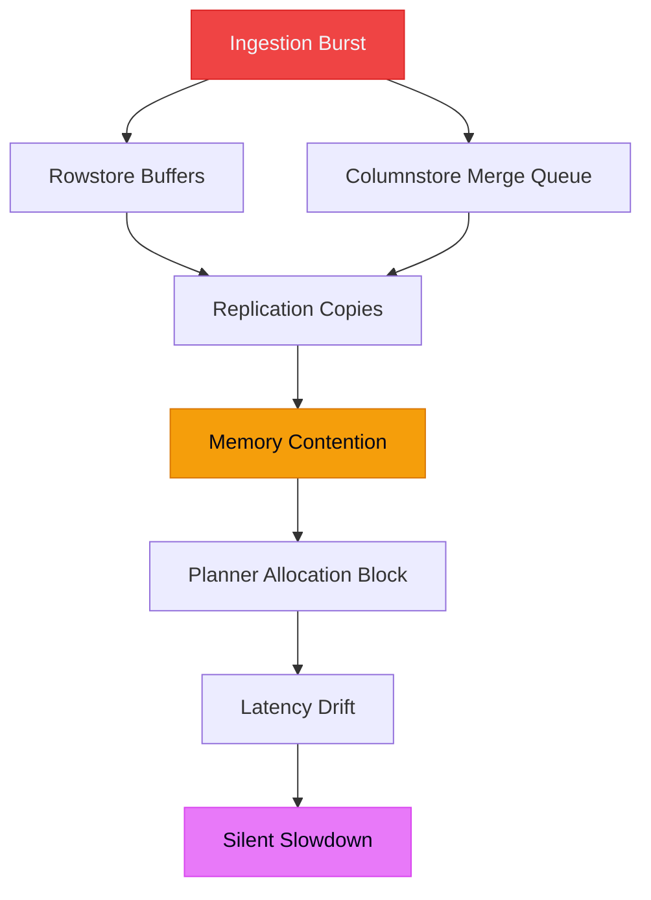
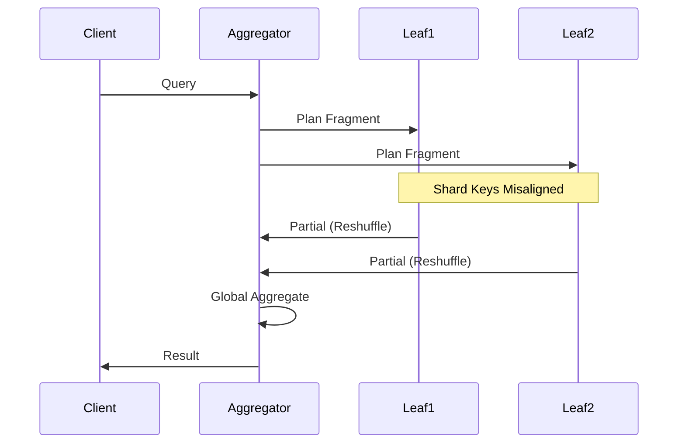
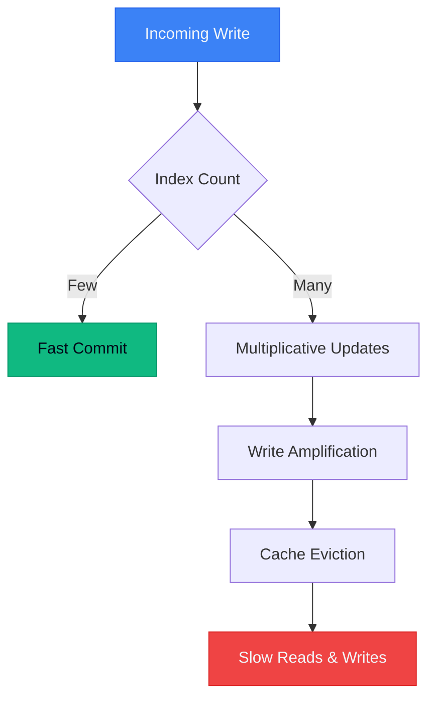

# Running HTAP Systems: What Actually Fails at Scale

HTAP systems are sold as convergence: one database, all workloads, no tradeoffs.

**That framing is wrong.**

HTAP is not about feature breadth. It is about how contention, memory pressure, and data movement fail under mixed load. The systems don't fall over. They slow down, sideways, while everyone argues about dashboards.

Distributed SQL doesn't hide this. It exposes it.

> **Part of the Distributed Systems Guide**: This post explores production failure modes in HTAP systems. For foundational concepts, start with [Getting Started with Distributed Databases](/blog/getting-started-distributed-databases).

---

## TL;DR

- **HTAP works until memory and locality are violated**
- **Unbounded queries, misaligned shards, and over-indexing** turn "normal" traffic into cluster-wide coordination failures
- **Design for locality, bound queries, scale vertically first**—or accept silent latency drift

---

## Content Summary

A senior engineer should understand the entire post from this list alone:

- **Memory in HTAP systems is a hard boundary**, not a tuning knob; replication and columnstore merges multiply usage and cause silent stalls
- **Execution engines reward locality**; misaligned shard keys trigger network reshuffles that dominate latency
- **Indexes are write-time liabilities**; over-indexing amplifies writes, evicts hot data, and slows everything without crashing
- **Query shape matters more than engine choice**; unbounded scans and `SELECT *` are latent production outages
- **Mixed OLTP/OLAP workloads fail through contention**, not saturation—latency drifts long before alerts fire
- **Horizontal scaling increases blast radius** and coordination costs; vertical scaling often buys more stability first
- **Failovers and schema changes are ops events**, not features; unrehearsed, they surface "worked in staging" failures

---

## Memory Pressure in Mixed Workloads

HTAP combines rowstores (OLTP) and columnstores (OLAP).
They share memory. They compete.

Under ingestion bursts:
- Rowstore buffers fill
- Columnstore merge queues back up
- Replication doubles memory footprints
- Dashboards scan wide tables

**Nothing crashes.** Planners block waiting for memory. p95 latency creeps from milliseconds to seconds.

This is not a bug. Memory is finite.

### Why Engineers Miss This

CPU is idle. Disks aren't full. Alerts stay green.

**The system is failing politely.**

---

## Execution Engines and Data Movement

Execution engines are simple:
- **Aggregators** plan and coordinate
- **Workers** scan and compute
- **The network** collects payment

**Local work is cheap. Data motion is not.**

Misaligned shard keys force repartitioning.
Global `GROUP BY` turns into all-to-all traffic.
Joins broadcast tables cluster-wide.

At scale, **coordination dominates compute**. One slow leaf delays the entire query.

Staging never shows this. Production always does.

---

## Write Amplification From Indexing

Indexes feel harmless because reads get faster.

**Writes pay the bill.**

Each index update is synchronous. Replication multiplies it. Columnstore maintenance adds more background work.

Low-selectivity indexes are especially damaging: they cost memory and writes while filtering nothing.

**The system doesn't crash. It just gets slower everywhere.**

---

## Query Shape Is the Real Scaling Limit

Three patterns cause most HTAP incidents:

1. **Unbounded time ranges**
2. **`SELECT *` on wide tables**
3. **Harmless queries run at scale**

A report scanning 100 GB daily looks fine at 1 GB. At 1 TB, it starves OLTP traffic.

HTAP contention is not fairness. Analytical queries evict transactional working sets. **The database does exactly what you asked.**

---

## Sideways Failures and Operational Reality

Distributed systems rarely fail cleanly.

- Schema changes propagate locks
- Failovers introduce lag and cache cold starts
- Partial partitions degrade only part of the cluster

**Horizontal scale increases coordination paths and blast radius.** Debugging gets harder. Failure modes multiply.

Vertical scaling preserves locality. Often, it's the safer first move.

---

## What Engineers Usually Get Wrong

| Assumption | Reality |
|------------|---------|
| Memory is tunable | It's a boundary. Replication math matters. |
| Distribution equals free parallelism | Repartitioning is a tax, not a feature. |
| Indexes are always good | They are permanent write costs. |
| The database is slow | The query shape is expensive. |
| HA reduces ops work | It increases state and failure modes. |

---

## What I'd Do Differently Next Time

1. **Size memory pessimistically** (≥1.5× estimates)
2. **Align shard keys to actual query paths early**
3. **Treat indexes as production code**—measure, justify, delete
4. **Enforce defaults**: limits, projections, time bounds
5. **Push vertical scale until locality breaks**
6. **Rehearse failovers and schema changes like deploys**

---

## Concise Takeaway

> HTAP fails quietly through contention and data motion.
> Locality beats parallelism.
> Bounded queries beat clever engines.
> **Latency tells the truth—listen early.**

---

## Further Reading

- [Distributed SQL Deep Dive: A 5-Part Series](/blog/distributed-sql-series-overview)
- [Why 'Indexes Everywhere' Destroys Database Performance](/blog/indexes-everywhere-antipattern)
- [Understanding SingleStore's Execution Engine (for Humans)](/blog/singlestore-execution-engine)
- [Lessons Learned Running SingleStore in Production](/blog/singlestore-production-lessons)

---

**Have you experienced silent HTAP failures?** I'd love to hear your war stories. [Email me](mailto:connect2shahidmoosa@gmail.com) or connect on [LinkedIn](https://linkedin.com).
