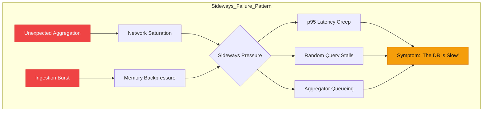

# Why HTAP Systems Fail Quietly (And How to Notice Early)

Distributed SQL and HTAP (Hybrid Transactional/Analytical Processing) are sold as convergence: one engine for everything, no tradeoffs, no ETL.

**HTAP doesn’t fail loudly. It fails sideways.**

It doesn't crash with "Connection Refused" when it hits a limit. It convinces you everything is fine, keeping your dashboards green while your p99 latency slowly drifts from milliseconds into seconds. By the time the user complains, the "slow burn" has already baked into your system.

> **Pillar Post: Distributed Systems Failure Modes.** 
> This is part of a series on high-scale database failure patterns. For foundational execution concepts, see [How Distributed SQL Execution Engines Really Work](/blog/distributed-sql-execution-engines).

---

## The Myth of ‘One Engine for Everything’

The promise of HTAP is that you can run analytical scans on the same data where you process transactions. But OLTP and OLAP are in constant tension:
- **OLTP** wants low-latency, small-batch, row-based access.
- **OLAP** wants high-throughput, large-scan, column-based access.

When you mix them, you aren't just sharing a CPU; you are sharing a **memory bus** and **merging queues**. In an HTAP system, "hybrid" often means "contention by design."

## Memory Is the First Thing to Lie

In a distributed database, memory isn't just a tuning knob; it's a hard boundary. HTAP systems share memory between rowstore buffers and columnstore merge queues.

Under mixed load:
1. **Replication math** doubles your memory footprint. 
2. **Columnstore maintenance** (merging segments) starts background jobs that you didn't schedule.
3. **Analytical scans** evict the transactional working set from the cache.

**The system stays online.** But the query planner starts blocking, waiting for tiny slices of memory to become available. This is the first invisible failure.

## Execution Engines Punish Data Movement

Execution engines reward locality. They punish data motion.
In a distributed environment, the network is your most expensive component. 

When HTAP systems scale, minor query mistakes—like misaligned shard keys—force the cluster to **reshuffle** gigabytes of data. At 1 GB, this is invisible. At 1 TB, the network becomes a bottleneck that starves every other query in the system.

## The Failure Pattern You Actually See

If you are waiting for a crash, you’ll miss the outage. HTAP failures manifest as **Sideways Failures**.

**Common Symptoms:**
- **p95 Creep**: Latency drifts linearly upward as data size grows.
- **Random Stalls**: Queries that usually take 50ms suddenly take 10s for no apparent reason.
- **"The Ghost in the Machine"**: CPU is idle, disks have IOPS to spare, but queries are queueing on the aggregator.

## Why Alerts Don’t Fire

Most monitoring is built on **thresholds**.
- "Alert if CPU > 80%"
- "Alert if Disk > 90%"

In an HTAP failure, these metrics often stay **perfectly healthy**. The system isn't saturated; it's **contended**. The problem isn't that you've run out of capacity; it's that the capacity is being used to move data sideways instead of returning it to the user.

> To fix this, you must monitor **latency shape**, not averages, and track **network repartitioning events** directly.

---

## What Engineers Usually Get Wrong
- **"It’s not red, so it’s fine"**: Green dashboards often hide p99 outliers that are killing user experience.
- **"More nodes will fix it"**: Horizontal scaling increases coordination paths. If you have a data movement problem, adding nodes just gives you more network to saturate.
- **"Indexes always help"**: In HTAP, indexes are write-time liabilities. Every index is a synchronous tax on your OLTP ingestion.

## What I’d Do Differently Next Time
1. **Size memory pessimistically**: Allocation should be ≥1.5× your peak estimates to account for replication and merge overhead.
2. **Align shard keys early**: Locality is the only free lunch in distributed systems.
3. **Separate workloads early**: Use read-replicas or separate analytical clusters as soon as analytical latency starts affecting transactional p99.
4. **Watch latency drift**: Look for linear increases in latency relative to data growth, not just threshold breaches.

## Concise Takeaway
HTAP fails quietly. Locality and memory decide your stability. If you see early latency drift, that is your primary alarm—don't wait for it to turn red.

---

**Is your database failing sideways?**
Understanding the "Query Shape" is the first step to fixing the execution engine. Check out [“The Database Is Slow” Is Usually a Lie](/blog/debugging-slow-database-queries) for the next step in this series.
