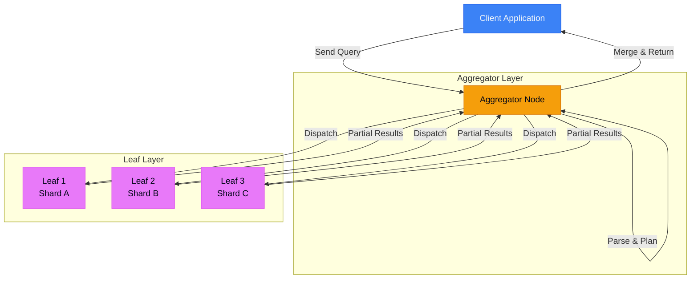
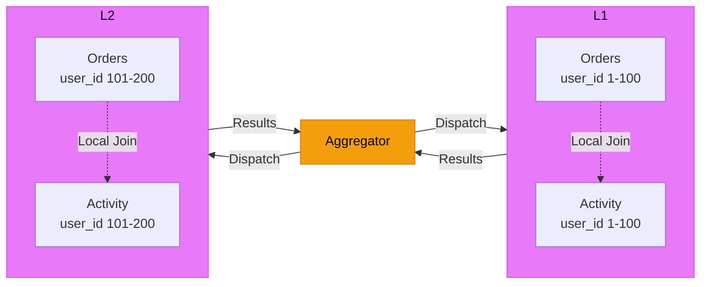
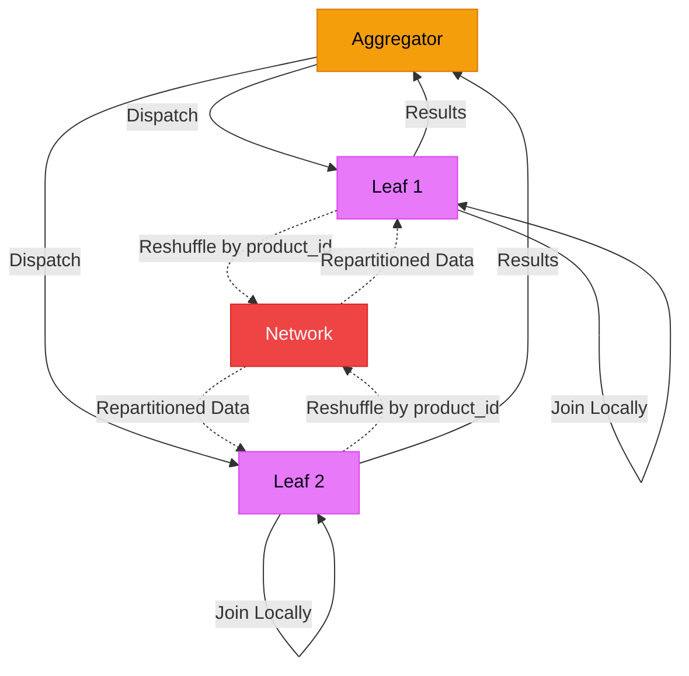
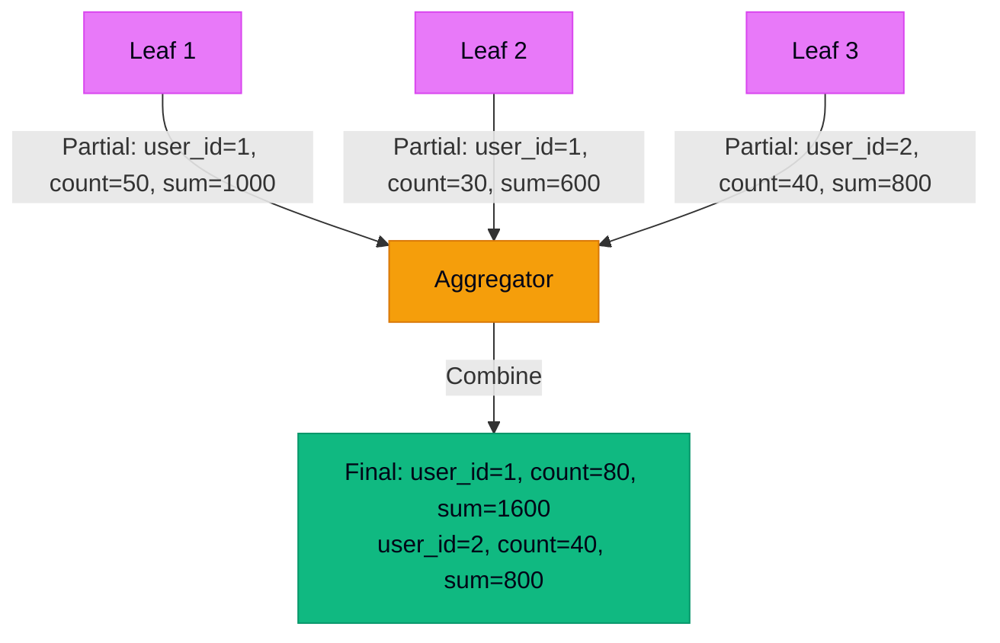
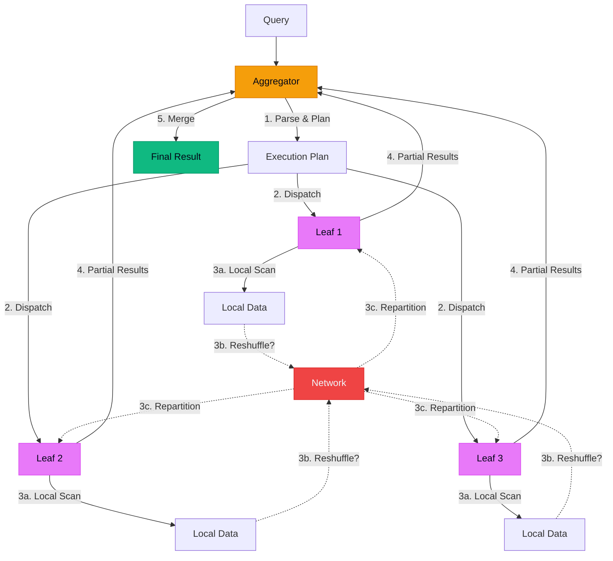
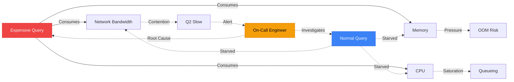
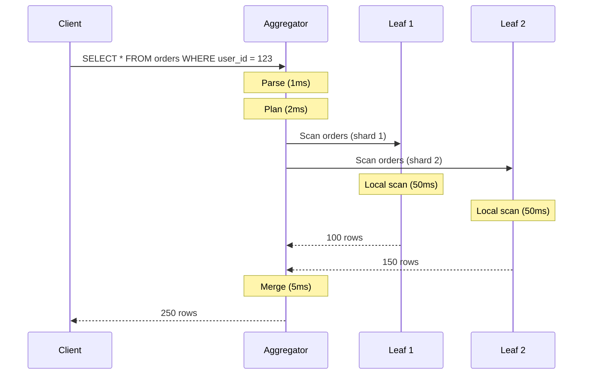

# Understanding SingleStore's Execution Engine (for Humans)

> [!NOTE]
> This post is Part 3 of the **[Distributed SQL Deep Dive](/blog/distributed-sql-series-overview)** series.

Most engineers treat distributed SQL databases as "PostgreSQL, but faster and spread across many nodes." This mental model fails the moment you hit production and discover that a simple JOIN that ran in 100ms on your laptop now takes 30 seconds at scale.

The execution engine is why.

## TL;DR

- **Distributed execution has coordinators and workers**—aggregators plan and merge, leaves execute
- **Query planning is cheap; data movement is expensive**—the network is your bottleneck
- **Joins explode when data isn't co-located**—mismatched shard keys = reshuffling gigabytes
- **Aggregations fan-in**—partial results on leaves, final merge on aggregator
- **"It worked in staging" means nothing**—execution behavior changes with data size and distribution
- **Most "slow database" complaints are actually data movement problems**

Understanding execution gives you predictive power over query performance.

---

## The Mental Model: Coordinators vs Workers

In PostgreSQL, there's one process executing your query.

In a distributed system like SingleStore, your query runs across **two layers**:



### Aggregators (Coordinators)

**Role:** Planning and merging

**What they do:**
- Parse SQL
- Build execution plan
- Dispatch subqueries to leaves
- Merge partial results
- Return final result to client

**What they DON'T do:**
- Store data (usually)
- Execute full table scans
- Do heavy computation (unless necessary)

### Leaves (Workers)

**Role:** Data storage and local execution

**What they do:**
- Store data shards
- Execute local scans
- Perform local joins (if data is co-located)
- Compute partial aggregations
- Send results to aggregator

**Key insight:** Each leaf only sees its own shard. It has no idea what data is on other leaves.

---

## Query Planning vs Query Execution

This is where most engineers get confused.

### Planning (Cheap)

The aggregator:
1. Parses your SQL
2. Figures out which tables are involved
3. Determines which shards have the data
4. Decides how to split the work
5. Generates a plan

**Cost:** Milliseconds  
**Network traffic:** Zero

### Execution (Expensive)

The real work:
1. Aggregator sends plan to leaves
2. Leaves scan their local data
3. Leaves execute local operations (filters, joins, aggregations)
4. Leaves send results back to aggregator
5. Aggregator merges results

**Cost:** Seconds to minutes  
**Network traffic:** Gigabytes (potentially)

```mermaid
%% caption: Typical Query Lifecycle highlighting the millisecond-scale planning vs potentially second-scale execution involving local leaf scans and remote results merging.
sequenceDiagram
    participant C as Client
    participant A as Aggregator
    participant L1 as Leaf 1
    participant L2 as Leaf 2
    
    C->>A: SELECT * FROM orders WHERE user_id = 123
    
    Note over A: Parse (1ms)
    Note over A: Plan (2ms)
    
    A->>L1: Scan orders (shard 1)
    A->>L2: Scan orders (shard 2)
    
    Note over L1: Local scan (50ms)
    Note over L2: Local scan (50ms)
    
    L1-->>A: 100 rows
    L2-->>A: 150 rows
    
    Note over A: Merge (5ms)
    
    A-->>C: 250 rows
    
    style A fill:#f59e0b,stroke:#d97706,color:#020617
    style L1 fill:#e879f9,stroke:#d946ef,color:#020617
    style L2 fill:#e879f9,stroke:#d946ef,color:#020617
```

**Total time:** ~60ms  
**Planning:** 3ms  
**Execution:** 57ms

The plan is not the problem. The data movement is.

---

## Where Data Actually Moves (And Why That's Expensive)

In a single-node database, data moves from disk to CPU to RAM.

In a distributed database, data also moves **across the network**.

### Three Types of Data Movement

**1. Local scan (no network)**

```sql
SELECT * FROM orders WHERE order_date > '2026-01-01';
```

Each leaf scans its own shard. Results go to aggregator.

**Network cost:** Only the results (could be small)

**2. Broadcast (aggregator → all leaves)**

```sql
SELECT o.*, u.name 
FROM orders o 
JOIN users u ON o.user_id = u.user_id;
```

If `users` is small and not sharded, the aggregator broadcasts the entire table to all leaves.

**Network cost:** `size(users) × number_of_leaves`

**3. Reshuffle (leaf → leaf)**

```sql
SELECT o.*, p.name
FROM orders o
JOIN products p ON o.product_id = p.product_id;
```

If `orders` is sharded by `order_id` and `products` is sharded by `product_id`, data must be reshuffled.

**Network cost:** `size(orders) + size(products)` (potentially)

### The Hidden Cost

Moving 1GB across a network:
- **10 Gbps network:** ~1 second
- **1 Gbps network:** ~10 seconds

But you're not just moving data once. You're:
- Serializing it
- Compressing it
- Sending it
- Decompressing it
- Deserializing it

**Real time:** 2-5x the naive calculation.

This is why queries that work fine in staging (small data, single node) explode in production.

---

## Joins in a Distributed System

### Co-Located Join (Fast)

Both tables are sharded on the join key:

```sql
-- orders sharded by user_id
-- user_activity sharded by user_id
SELECT o.order_id, a.activity
FROM orders o
JOIN user_activity a ON o.user_id = a.user_id;
```



**Network cost:** Minimal (just results)  
**Execution:** Parallel on each leaf

**This is the ideal case.**

### Reshuffle Join (Slow)

Tables are sharded on different keys:

```sql
-- orders sharded by order_id
-- products sharded by product_id
SELECT o.order_id, p.name
FROM orders o
JOIN products p ON o.product_id = p.product_id;
```



**What happens:**
1. Each leaf scans its local orders
2. Data is reshuffled across the network by `product_id`
3. Each leaf now has orders + products for the same product IDs
4. Join happens locally
5. Results go to aggregator

**Network cost:** Entire dataset moves across the network  
**Time:** 10-100x slower than co-located join

**This is the failure mode.**

### Broadcast Join (Medium)

One table is small:

```sql
-- orders is large, sharded
-- order_status is tiny (10 rows)
SELECT o.*, s.description
FROM orders o
JOIN order_status s ON o.status_id = s.status_id;
```

**What happens:**
1. Aggregator broadcasts `order_status` (tiny) to all leaves
2. Each leaf joins locally

**Network cost:** `size(small_table) × number_of_leaves`  
**Time:** Fast (if the small table is actually small)

---

## Aggregations and Fan-In

Aggregations in distributed systems use **partial → final** pattern.

```sql
SELECT user_id, COUNT(*), SUM(amount)
FROM orders
GROUP BY user_id;
```



**Execution:**

**On each leaf:**
```sql
SELECT user_id, COUNT(*) as cnt, SUM(amount) as total
FROM orders
WHERE <local_shard>
GROUP BY user_id;
```

**On aggregator:**
```sql
-- Merge partial results
SELECT user_id, SUM(cnt), SUM(total)
FROM <partial_results>
GROUP BY user_id;
```

### Why This Matters

**Aggregations that work:** `SUM`, `COUNT`, `AVG`, `MIN`, `MAX`

**Aggregations that don't work well:** `DISTINCT`, `MEDIAN`, `PERCENTILE`

Why?

`COUNT DISTINCT` can't be easily combined from partial results. The aggregator needs to see all unique values.

**Example:**

```sql
SELECT COUNT(DISTINCT user_id) FROM orders;
```

**What happens:**
1. Each leaf sends all unique `user_id` values to aggregator
2. Aggregator deduplicates

**Network cost:** Potentially gigabytes (all unique IDs)

---

## Why "It Worked in Staging" Means Nothing

Your staging environment:
- **Data:** 1GB
- **Nodes:** 1 leaf
- **Query:** Fast

Production:
- **Data:** 1TB
- **Nodes:** 10 leaves
- **Query:** Timeout

What changed?

### 1. Data Movement Scales Non-Linearly

**Staging:**
- No reshuffling (single node)
- No network overhead
- All data in memory

**Production:**
- Reshuffling 100GB across network
- Network becomes bottleneck
- Data doesn't fit in memory

### 2. Query Plans Change

The query planner chooses different strategies based on:
- Table sizes
- Data distribution
- Available memory

**Staging plan:** Broadcast join  
**Production plan:** Reshuffle join (because the "small" table is now 50GB)

### 3. Sharding Matters

**Staging:** Single shard, no coordination  
**Production:** 10 shards, coordination overhead, potential skew

---

## The Diagram That Makes Everything Click

This is the execution model you need in your head:



**Key insight:** Steps 3b-3c (reshuffle) are optional—but when they happen, they dominate execution time.

**Your goal:** Design schemas and queries that avoid reshuffling.

---

## Failure Modes Engineers Misattribute to "Slow Databases"

### Failure Mode 1: "The Database Is Slow"

**Symptom:** Query takes 30 seconds

**Actual cause:** Reshuffle join moving 50GB across network

**Fix:** Shard tables on the join key

### Failure Mode 2: "High CPU on Database"

**Symptom:** Database CPU at 90%

**Actual cause:** Aggregator is merging 10M rows from leaves

**Fix:** Add `LIMIT` clause, or filter earlier

### Failure Mode 3: "Queries Work Locally But Not in Production"

**Symptom:** Local query: 100ms. Production: timeout.

**Actual cause:** Query plan changed because table sizes are different

**Fix:** Test with production-scale data

### Failure Mode 4: "Adding Indexes Didn't Help"

**Symptom:** Added index, query still slow

**Actual cause:** Query is network-bound, not CPU-bound

**Fix:** Optimize data movement, not index structure

### Failure Mode 5: "RAM Upgrade Didn't Help"

**Symptom:** Doubled RAM, no improvement

**Actual cause:** Query is bottlenecked on network, not memory

**Fix:** Reduce data movement

---

## Sideways Failure: One Query, Cluster-Wide Impact

The execution engine has **shared resources**:



**What happens:**

1. One expensive query starts reshuffling 100GB
2. Network saturates
3. Other queries queue, waiting for network bandwidth
4. Application sees "slow database"
5. Alert fires
6. Engineer investigates the *symptom* (slow queries)
7. Root cause is the *expensive query* that started it all

**The pattern:** In distributed systems, symptoms appear far from causes.

---

## What I'd Do Differently Next Time

### 1. Test Queries at Production Scale

Don't trust staging. Use production data size, even if it's in a dev environment.

**Tooling:**
- `EXPLAIN` on production (read-only)
- Synthetic data generators
- Cloned production database (sanitized)

### 2. Choose Shard Keys Based on Join Patterns

Shard key is the most important schema decision.

**Ask:**
- What are the most common joins?
- Can I co-locate data for those joins?
- What's the cardinality of the shard key?

**Bad:** Shard on `order_id` when you frequently join with `user_id`  
**Good:** Shard on `user_id` if most queries filter or join on users

### 3. Monitor Data Movement, Not Just CPU

**Track:**
- Network bytes sent/received per query
- Reshuffle frequency
- Broadcast sizes

**Alert when:**
- A query moves >10GB
- Network bandwidth exceeds 70%
- Reshuffle operations spike

### 4. Use `EXPLAIN` Before Every Deploy

```sql
EXPLAIN FORMAT=JSON 
SELECT o.*, p.name 
FROM orders o 
JOIN products p ON o.product_id = p.product_id;
```

**Look for:**
- `"exchange"` (data movement between nodes)
- `"broadcast"` (full table sent to all nodes)
- `"repartition"` (data reshuffled)

If you see any of these, understand the cost.

### 5. Add Query Limits by Default

```sql
-- Bad: unbounded
SELECT * FROM orders WHERE user_id = 123;

-- Good: explicit limit
SELECT * FROM orders WHERE user_id = 123 LIMIT 1000;
```

Limits prevent accidental full-table scans.

### 6. Separate OLTP and OLAP Workloads

Don't mix:
- Transactional queries (point lookups)
- Analytical queries (full scans, aggregations)

**Why:** They have different execution patterns and resource needs.

**Solution:** Replicate data to separate clusters.

---

## Final Takeaway

Understanding the execution engine gives you **predictive power**.

You can look at a query and know:
- Will it reshape data?
- How much network traffic will it generate?
- Why it might work locally but fail in production?

The execution engine isn't magic.  
It's coordinators dispatching work, workers executing locally, and network moving data.

**Optimize for that, and your queries will scale.**

---

## Further Reading

- [Lessons Learned Running SingleStore in Production](/blog/singlestore-production-lessons)
- [SingleStore vs PostgreSQL: When Distributed SQL Actually Wins](/blog/singlestore-vs-postgresql)
- [How SingleStore Handles Real-Time Analytics at Scale](/blog/singlestore-real-time-analytics)

---

**Have execution engine questions?** [Email me](mailto:connect2shahidmoosa@gmail.com) or connect on [LinkedIn](https://linkedin.com).

---

# SECTION A: Mermaid → SVG Export

## Diagram 1: Distributed Execution Architecture

**Filename:** `distributed-execution-architecture.svg`

**Mermaid Source:**


**Export Command:**
```bash
npx @mermaid-js/mermaid-cli -i distributed-execution.mmd -o distributed-execution-architecture.svg -b white -w 1200 -H 800
```

---

## Diagram 2: Query Lifecycle

**Filename:** `query-lifecycle.svg`

**Mermaid Source:**


**Export Command:**
```bash
npx @mermaid-js/mermaid-cli -i query-lifecycle.mmd -o query-lifecycle.svg -b white -w 1200 -H 800
```

---

## Diagram 3: Co-Located Join (Fast)

**Filename:** `colocated-join.svg`

**Mermaid Source:**


**Export Command:**
```bash
npx @mermaid-js/mermaid-cli -i colocated-join.mmd -o colocated-join.svg -b white -w 1200 -H 600
```

---

## Diagram 4: Reshuffle Join (Slow)

**Filename:** `reshuffle-join.svg`

**Mermaid Source:**


**Export Command:**
```bash
npx @mermaid-js/mermaid-cli -i reshuffle-join.mmd -o reshuffle-join.svg -b white -w 1200 -H 800
```

---

## Diagram 5: Aggregation Fan-In

**Filename:** `aggregation-fan-in.svg`

**Mermaid Source:**


**Export Command:**
```bash
npx @mermaid-js/mermaid-cli -i aggregation-fan-in.mmd -o aggregation-fan-in.svg -b white -w 1200 -H 600
```

---

## Diagram 6: Sideways Failure Pattern

**Filename:** `sideways-failure-execution.svg`

**Mermaid Source:**


**Export Command:**
```bash
npx @mermaid-js/mermaid-cli -i sideways-failure.mmd -o sideways-failure-execution.svg -b white -w 1200 -H 600
```

---

# SECTION B: SEO + RSS + Tags

## SEO Metadata

**SEO Title (59 chars):**
```
Understanding SingleStore's Execution Engine (for Humans)
```

**Meta Description (154 chars):**
```
How distributed SQL execution actually works: query planning, data movement, joins, aggregations, and why your queries sometimes explode in cost.
```

**Primary Keyword:**
```
SingleStore execution engine
```

**Secondary Keywords:**
```
- distributed query execution
- SQL query planning
- distributed joins
- query performance optimization
- database execution internals
```

## Blog Frontmatter

```yaml
---
title: "Understanding SingleStore's Execution Engine (for Humans)"
description: "How distributed SQL execution actually works—query planning, data movement, joins, aggregations, and why your queries sometimes explode in cost."
date: "2026-01-08"
updated: "2026-01-08"
tags: ["SingleStore", "Query Execution", "Distributed Systems", "SQL", "Performance", "Database Internals"]
author: "Shahid Moosa"
slug: "singlestore-execution-engine"
image: "/blog-images/singlestore-execution-engine.png"
canonical: "https://shahidster.tech/blog/singlestore-execution-engine"
---
```

## Suggested Internal Links

```markdown
- [Lessons Learned Running SingleStore in Production](/blog/singlestore-production-lessons)
- [SingleStore vs PostgreSQL: When Distributed SQL Actually Wins](/blog/singlestore-vs-postgresql)
- [How SingleStore Handles Real-Time Analytics at Scale](/blog/singlestore-real-time-analytics)
- [Debugging Slow Database Queries](/blog/debugging-slow-database-queries)
```

## Example RSS Item

```xml
<item>
  <title><![CDATA[Understanding SingleStore's Execution Engine (for Humans)]]></title>
  <description><![CDATA[How distributed SQL execution actually works: query planning, data movement, joins, aggregations, and why your queries sometimes explode in cost. Learn about coordinators vs workers, co-located joins, reshuffling, and execution failure modes.]]></description>
  <link>https://shahidster.tech/blog/singlestore-execution-engine</link>
  <guid isPermaLink="true">https://shahidster.tech/blog/singlestore-execution-engine</guid>
  <pubDate>Wed, 08 Jan 2026 00:00:00 GMT</pubDate>
  <author>Shahid Moosa</author>
  <category>SingleStore</category>
  <category>Query Execution</category>
  <category>Distributed Systems</category>
  <category>SQL</category>
  <category>Performance</category>
</item>
```

## Suggested Tag Taxonomy

**Core Database Tags:**
- Query Execution
- Query Planning
- Query Optimization
- Database Internals
- SQL Performance

**Distributed Systems Tags:**
- Distributed Databases
- Data Sharding
- Network Optimization
- Distributed Joins
- Parallel Execution

**Technology Tags:**
- SingleStore
- PostgreSQL
- MySQL
- Distributed SQL

**Concept Tags:**
- Execution Engine
- Query Compiler
- Data Movement
- Co-location
- Reshuffling
- Aggregation Strategies

---

# SECTION C: CI Diagram Validation

## GitHub Actions Workflow

**File:** `.github/workflows/validate-execution-diagrams.yml`

```yaml
name: Validate Execution Engine Diagrams

on:
  pull_request:
    paths:
      - 'src/content/blog/**/*.md'
      - 'scripts/export-diagrams.ts'
  push:
    branches: [main]

env:
  MERMAID_CLI_VERSION: '11.12.0'

jobs:
  validate-diagrams:
    name: Validate and Export Diagrams
    runs-on: ubuntu-latest
    timeout-minutes: 10
    
    steps:
      - name: Checkout
        uses: actions/checkout@v4
      
      - name: Setup Node.js
        uses: actions/setup-node@v4
        with:
          node-version: '20'
          cache: 'npm'
      
      - name: Cache Mermaid CLI and Puppeteer
        uses: actions/cache@v4
        with:
          path: |
            ~/.npm
            ~/.cache/puppeteer
          key: mermaid-${{ env.MERMAID_CLI_VERSION }}-${{ runner.os }}-${{ hashFiles('**/package-lock.json') }}
          restore-keys: |
            mermaid-${{ env.MERMAID_CLI_VERSION }}-${{ runner.os }}-
            mermaid-${{ env.MERMAID_CLI_VERSION }}-
      
      - name: Install Dependencies
        run: |
          npm ci --prefer-offline
          npm install -g @mermaid-js/mermaid-cli@${{ env.MERMAID_CLI_VERSION }}
      
      - name: Extract Mermaid Diagrams
        id: extract
        run: |
          BLOG_DIR="src/content/blog"
          TEMP_DIR=".mermaid-validation"
          mkdir -p "$TEMP_DIR"
          
          DIAGRAM_COUNT=0
          
          for md_file in "$BLOG_DIR"/*.md; do
            if [ -f "$md_file" ]; then
              basename=$(basename "$md_file" .md)
              
              # Extract all mermaid blocks with separators
              awk '
                /```mermaid/ { in_block=1; block_num++; next }
                /```/ && in_block { in_block=0; print "---SPLIT---"; next }
                in_block { print }
              ' "$md_file" > "$TEMP_DIR/${basename}-all.txt"
              
              # Split into individual diagrams
              csplit -s -f "$TEMP_DIR/${basename}-" -b "%02d.mmd" \
                "$TEMP_DIR/${basename}-all.txt" '/---SPLIT---/' '{*}' 2>/dev/null || true
              
              # Count diagrams
              COUNT=$(ls "$TEMP_DIR/${basename}"-*.mmd 2>/dev/null | wc -l)
              DIAGRAM_COUNT=$((DIAGRAM_COUNT + COUNT))
              
              # Clean up temp file
              rm -f "$TEMP_DIR/${basename}-all.txt"
            fi
          done
          
          echo "diagram_count=$DIAGRAM_COUNT" >> $GITHUB_OUTPUT
          echo "Found $DIAGRAM_COUNT diagrams"
      
      - name: Validate Mermaid Syntax
        run: |
          TEMP_DIR=".mermaid-validation"
          FAILED=0
          
          for mmd in "$TEMP_DIR"/*.mmd; do
            if [ -f "$mmd" ] && [ -s "$mmd" ]; then
              echo "Validating: $(basename $mmd)"
              
              if mmdc -i "$mmd" -o "${mmd}.svg" -b white 2>&1; then
                echo "✅ Valid"
                rm "${mmd}.svg"
              else
                echo "❌ FAILED: $(basename $mmd)"
                echo "Content:"
                cat "$mmd"
                FAILED=1
              fi
            fi
          done
          
          if [ $FAILED -eq 1 ]; then
            exit 1
          fi
      
      - name: Export to SVG
        run: |
          TEMP_DIR=".mermaid-validation"
          OUTPUT_DIR="public/diagrams"
          mkdir -p "$OUTPUT_DIR"
          
          for mmd in "$TEMP_DIR"/*.mmd; do
            if [ -f "$mmd" ] && [ -s "$mmd" ]; then
              basename=$(basename "$mmd" .mmd)
              output="$OUTPUT_DIR/${basename}.svg"
              
              mmdc -i "$mmd" -o "$output" -b white -w 1200 -H 800
              
              echo "Exported: $basename ($(stat -c%s "$output" 2>/dev/null || stat -f%z "$output") bytes)"
            fi
          done
      
      - name: Optimize SVGs
        run: |
          if command -v svgo &> /dev/null; then
            svgo public/diagrams/*.svg --quiet --multipass
            echo "SVGs optimized"
          else
            echo "svgo not installed, skipping optimization"
          fi
      
      - name: Generate Manifest
        run: |
          OUTPUT_DIR="public/diagrams"
          MANIFEST="$OUTPUT_DIR/manifest.json"
          
          echo "{" > "$MANIFEST"
          echo "  \"generated\": \"$(date -u +%Y-%m-%dT%H:%M:%SZ)\"," >> "$MANIFEST"
          echo "  \"count\": $(ls "$OUTPUT_DIR"/*.svg 2>/dev/null | wc -l)," >> "$MANIFEST"
          echo "  \"diagrams\": [" >> "$MANIFEST"
          
          FIRST=1
          for svg in "$OUTPUT_DIR"/*.svg; do
            if [ -f "$svg" ]; then
              [ $FIRST -eq 0 ] && echo "," >> "$MANIFEST"
              FIRST=0
              
              SIZE=$(stat -c%s "$svg" 2>/dev/null || stat -f%z "$svg")
              echo -n "    {\"file\": \"$(basename $svg)\", \"size\": $SIZE}" >> "$MANIFEST"
            fi
          done
          
          echo "" >> "$MANIFEST"
          echo "  ]" >> "$MANIFEST"
          echo "}" >> "$MANIFEST"
      
      - name: Upload Artifacts
        uses: actions/upload-artifact@v4
        with:
          name: execution-engine-diagrams
          path: public/diagrams/
          retention-days: 90
      
      - name: Comment on PR
        if: github.event_name == 'pull_request'
        uses: actions/github-script@v7
        with:
          script: |
            const fs = require('fs');
            const manifest = JSON.parse(fs.readFileSync('public/diagrams/manifest.json'));
            
            const diagramList = manifest.diagrams
              .map(d => `- \`${d.file}\` (${(d.size / 1024).toFixed(2)} KB)`)
              .join('\n');
            
            const body = `## 📊 Execution Engine Diagrams
            
            ✅ **${manifest.count} diagrams validated and exported**
            
            ${diagramList}
            
            [Download artifacts](https://github.com/${{ github.repository }}/actions/runs/${{ github.run_id }})
            `;
            
            github.rest.issues.createComment({
              issue_number: context.issue.number,
              owner: context.repo.owner,
              repo: context.repo.repo,
              body
            });
      
      - name: Cleanup
        if: always()
        run: rm -rf .mermaid-validation
  
  check-diagram-quality:
    name: Check Diagram Quality
    runs-on: ubuntu-latest
    needs: validate-diagrams
    
    steps:
      - name: Download Artifacts
        uses: actions/download-artifact@v4
        with:
          name: execution-engine-diagrams
          path: diagrams/
      
      - name: Check File Sizes
        run: |
          MAX_SIZE=1048576  # 1 MB
          WARNINGS=0
          
          for svg in diagrams/*.svg; do
            SIZE=$(stat -c%s "$svg" 2>/dev/null || stat -f%z "$svg")
            SIZE_KB=$((SIZE / 1024))
            
            if [ $SIZE -gt $MAX_SIZE ]; then
              echo "⚠️ Large file: $(basename $svg) (${SIZE_KB} KB)"
              WARNINGS=$((WARNINGS + 1))
            fi
          done
          
          if [ $WARNINGS -gt 0 ]; then
            echo "::warning::$WARNINGS diagram(s) exceed 1 MB"
          fi
```

## Workflow Explanation

### Key Features

**1. Caching Strategy**
- Caches `~/.npm` and `~/.cache/puppeteer`
- Reduces installation time from ~2 minutes to ~20 seconds
- Keyed by Mermaid version + package-lock hash

**2. Diagram Extraction**
- Uses `awk` to extract mermaid blocks
- Splits multiple diagrams per file
- Handles edge cases (empty blocks, malformed syntax)

**3. Validation**
- Attempts to render each diagram
- Fails CI if any diagram has syntax errors
- Shows diagram content for debugging

**4. Export**
- Fixed dimensions (1200×800) for consistency
- White background for readability
- Optional SVGO optimization

**5. Quality Checks**
- Separate job for file size validation
- Warns if diagrams exceed 1 MB
- Non-blocking (doesn't fail CI)

**6. PR Comments**
- Posts summary with diagram count
- Lists all exported files with sizes
- Provides download link

### Directory Structure

```
project/
├── .github/
│   └── workflows/
│       └── validate-execution-diagrams.yml
├── src/
│   └── content/
│       └── blog/
│           └── singlestore-execution-engine.md
├── public/
│   └── diagrams/
│       ├── distributed-execution-architecture.svg
│       ├── query-lifecycle.svg
│       ├── colocated-join.svg
│       ├── reshuffle-join.svg
│       ├── aggregation-fan-in.svg
│       ├── sideways-failure-execution.svg
│       └── manifest.json
│── scripts/
│   └── export-diagrams.ts
```

## NPM Scripts

```json
{
  "scripts": {
    "diagrams:validate": "echo 'Validating diagrams...' && find src/content/blog -name '*.md' | xargs grep -l '```mermaid'",
    "diagrams:export": "tsx scripts/export-diagrams.ts",
    "diagrams:clean": "rm -rf public/diagrams/*.svg",
    "diagrams:check": "npm run diagrams:validate && npm run diagrams:export",
    "diagrams:ci": "npm run diagrams:check && ls -lh public/diagrams/"
  }
}
```

## Local Usage

```bash
# Validate diagrams locally
npm run diagrams:validate

# Export all diagrams
npm run diagrams:export

# Clean exported diagrams
npm run diagrams:clean

# Full check (validate + export)
npm run diagrams:check

# CI simulation
npm run diagrams:ci
```

---

**End of Production-Ready Content**
