```mermaid
flowchart TD
    APP[Application Writes] --> RS[Rowstore]
    DASH[Dashboard Query] --> CS[Columnstore]
    BATCH[Batch Load] --> CS
    
    RS -.->|Background Sync| CS
    
    subgraph Resources
        CPU[CPU Cores]
        IO[Disk I/O]
        NET[Network Bandwidth]
    end
    
    RS --> CPU
    RS --> IO
    CS --> CPU
    CS --> IO
    BATCH --> IO
    BATCH --> NET
    
    CPU -.->|Contention| SLOW1[Write Latency ↑]
    IO -.->|Contention| SLOW2[Query Latency ↑]
    NET -.->|Contention| SLOW3[Replication Lag ↑]
    
    style APP fill:#3b82f6,stroke:#2563eb,color:#f1f5f9
    style DASH fill:#e879f9,stroke:#d946ef,color:#020617
    style BATCH fill:#f59e0b,stroke:#d97706,color:#020617
    style SLOW1 fill:#ef4444,stroke:#dc2626,color:#f1f5f9
    style SLOW2 fill:#ef4444,stroke:#dc2626,color:#f1f5f9
    style SLOW3 fill:#ef4444,stroke:#dc2626,color:#f1f5f9
```

# Lessons Learned Running SingleStore in Production (The Painful Ones)

> [!NOTE]
> This post is Part 4 of the **[Distributed SQL Deep Dive](/blog/distributed-sql-series-overview)** series.

After two years supporting production SingleStore clusters—from 3-node dev environments to 40-node monsters processing 500K TPS—I've learned that most outages start with confident assumptions. This post covers the mistakes that hurt.

## TL;DR

- **Memory isn't optional**—it's the hard requirement that determines everything else
- **Query patterns matter more than hardware**—one bad JOIN reshuffles terabytes across your network
- **HTAP means shared resource contention**—analytics and OLTP fight for the same CPU/IO
- **Schema changes are deployment events**—not DBA tasks
- **High availability requires active-active**—passive standby is an expensive lie
- **Distributed systems fail sideways**—the symptom appears nowhere near the cause

If you're evaluating HTAP databases, this post explains what the vendor won't tell you.

---

## Memory: The Requirement Everyone Treats as an Optimization

This is the mistake that cost us the most money.

We sized our first production cluster based on **data size**. We had 2TB of active data, so we provisioned 3TB of storage with 128GB RAM per node. Math seemed fine.

**We were consistently OOM within 48 hours.**

### Why Memory Is Non-Negotiable

SingleStore (and most columnar stores) aren't like PostgreSQL. You can't just swap to disk when memory runs out. Here's what actually happens:


**The rowstore** (transactional data) needs memory for:
- Active transactions
- MVCC versioning
- Index pages
- Lock tables

**The columnstore** (analytical data) needs memory for:
- Segment decompression
- Hash table builds during aggregations
- Sort buffers
- Result sets

**Background merges** consolidate small segments into larger ones. If they run out of memory, they spill to disk. This is 2-5x slower and creates cascade failures during heavy write periods.

**Replication** doubles memory pressure because you're holding:
- Original data in memory
- Replicated data being written
- Replication log entries

### The Incident

**What happened:**

Our dashboard query ran every 5 minutes:

```sql
SELECT user_id, COUNT(*), SUM(amount)
FROM orders
WHERE created_at > NOW() - INTERVAL 1 HOUR
GROUP BY user_id;
```

Simple query. On PostgreSQL, this would be 100ms.

On SingleStore, during peak traffic:
- Query needs to decompress ~500MB of columnstore segments
- Build hash table for 2M unique users
- Aggregate across 8 leaf nodes
- Merge results on aggregator

**Memory required: ~12GB per query.**

We had 10 concurrent dashboards running this query.

**Result:** OOM kills, node restarts, cluster instability.

### What We Did Wrong

1. **Sized for data, not workload**
2. **Didn't account for query memory amplification**
3. **Ignored background process overhead**
4. **Ran OLTP and OLAP on the same memory pool**

### What We Should Have Done

**Memory sizing formula:**

```
Total Memory = (Data * 0.3) + (Peak Query Concurrency * Max Query Memory) + (Write Buffer * 2) + 20% safety
```

For our workload:
- Data: 2TB
- Peak queries: 20
- Max query memory: 8GB
- Write buffer: 50GB

**Required: 600GB + 160GB + 100GB + 150GB = ~1TB RAM**

We had 384GB total (128GB × 3 nodes).

**We were off by 3x.**

---

## Query Patterns That Quietly Destroy Performance

The second-hardest lesson: **SingleStore's query planner doesn't save you from yourself.**

### The Distributed JOIN That Killed Us

```sql
-- Looks innocent
SELECT u.email, o.order_count, o.total_revenue
FROM users u
JOIN (
  SELECT user_id, COUNT(*) as order_count, SUM(amount) as total_revenue
  FROM orders
  WHERE created_at > '2025-01-01'
  GROUP BY user_id
) o ON u.user_id = o.user_id
WHERE u.status = 'active';
```

On a single-node database, this is fine.

On a distributed system:

```mermaid
sequenceDiagram
    participant App
    participant Agg as Aggregator
    participant L1 as Leaf 1
    participant L2 as Leaf 2
    participant L3 as Leaf 3
    
    App->>Agg: Execute Query
    
    Agg->>L1: Scan orders (shard 1)
    Agg->>L2: Scan orders (shard 2)
    Agg->>L3: Scan orders (shard 3)
    
    L1-->>Agg: 500MB partial results
    L2-->>Agg: 600MB partial results
    L3-->>Agg: 550MB partial results
    
    Note over Agg: Merge aggregations<br/>(1.6GB in memory)
    
    Agg->>L1: Broadcast users table
    Agg->>L2: Broadcast users table
    Agg->>L3: Broadcast users table
    
    Note over L1,L3: Join locally<br/>(200MB users × 3 = 600MB network)
    
    L1-->>Agg: Join results
    L2-->>Agg: Join results
    L3-->>Agg: Join results
    
    Agg-->>App: Final result
    
    style Agg fill:#f59e0b,stroke:#d97706,color:#020617
    style L1 fill:#e879f9,stroke:#d946ef,color:#020617
    style L2 fill:#e879f9,stroke:#d946ef,color:#020617
    style L3 fill:#e879f9,stroke:#d946ef,color:#020617
```

**Total data movement: 2.8GB**

For a query that returns 50KB of results.

### What Went Wrong

The `users` table (200MB, rowstore) got broadcast to all leaf nodes because it wasn't sharded on `user_id`.

**The fix:**

```sql
-- Shard users table on user_id
ALTER TABLE users SHARD KEY (user_id);
```

After this change:
- No broadcast
- Co-located joins
- Network transfer: <1MB

**Query time: 12 seconds → 200ms**

### The Pattern

**Bad:** Join tables with mismatched shard keys  
**Good:** Co-locate data by the JOIN column

**Bad:** GROUP BY high-cardinality column (user_id)  
**Good:** Pre-aggregate or use columnar indexes

**Bad:** `SELECT *` in distributed queries  
**Good:** Explicit column selection

---

## Ingest + Analytics Contention (Or: Why Your Dashboard Killed Your API)

HTAP promises you can run analytics without hurting OLTP.

**This is true—until it isn't.**



### The Incident

**Context:**  
E-commerce platform. Black Friday. Peak traffic: 50K writes/sec.

**What we did:**  
Launched a real-time fraud dashboard powered by a complex analytical query that ran every 30 seconds.

**What happened:**

1. Dashboard query scans 500M rows
2. CPU spikes to 95% across all leaf nodes
3. Rowstore writes slow down (P99: 5ms → 50ms)
4. Application timeouts start
5. Connection pool exhausts
6. API unavailable

**Duration: 22 minutes**

### Root Cause

The fraud query was I/O bound, reading gigabytes of columnstore data.

This saturated disk I/O, causing:
- Rowstore writes to queue
- WAL fsync to slow down
- Transaction latency to spike

We had three workloads fighting for the same disk:
1. Transactional writes (critical)
2. Analytical scans (optional)
3. Background merges (necessary)

**There was no resource isolation.**

### The Fix

**Short term:**
- Moved dashboard to read replica
- Added query timeout (30s max)
- Implemented query queue limits

**Long term:**
- Separate OLTP and OLAP clusters
- Replicate data from OLTP to OLAP
- Accept seconds of lag for analytics

**Lesson:** HTAP works until your workloads spike simultaneously. Then you need separation.

---

## Schema Changes: The Operational Blind Spot

In PostgreSQL, `ALTER TABLE` is a DBA task.

In a distributed database, it's a **deployment event**.

### What We Learned

Adding a column to a 1TB table:

```sql
ALTER TABLE orders ADD COLUMN affiliate_id INT;
```

**Expected: Metadata update, instant**  
**Actual: 6-hour cluster lock, production outage**

### Why It Broke

1. **Rowstore compaction triggered**—rearranging rows for new column
2. **Columnstore segments rebuilt**—all 1TB re-encoded
3. **Replication backlog exploded**—every node replicating schema change
4. **Queries queued**—table locked during rebuild
5. **Connection pool exhausted**—timeouts cascaded

### The Pattern

Schema changes in distributed systems:
- Touch every partition
- Require inter-node coordination
- Block concurrent writes
- Amplify network traffic

### What We Do Now

**1. Add columns as nullable**

```sql
-- Bad: NOT NULL requires default value fill
ALTER TABLE orders ADD COLUMN status VARCHAR(20) NOT NULL DEFAULT 'pending';

-- Good: Nullable, backfill separately
ALTER TABLE orders ADD COLUMN status VARCHAR(20);
-- Backfill in batches, off-peak
UPDATE orders SET status = 'pending' WHERE status IS NULL LIMIT 100000;
```

**2. Test on read replica first**

**3. Schedule during maintenance windows**

**4. Monitor replication lag**

**5. Have rollback plan**

---

## High Availability: Myths vs Reality

**Myth:** "We have replication, so we're highly available."

**Reality:** Passive replicas are disaster recovery, not high availability.

### The Failure Mode Nobody Expects

**Setup:**
- 3-node cluster
- Synchronous replication
- "5 nines" SLA from vendor

**Incident:**
- Primary leaf node fails (disk corruption)
- Automatic failover to replica
- **Failover time: 45 seconds**

For a system doing 50K TPS, 45 seconds = **2.25 million failed requests**.

### Why Failover Is Slow

1. **Failure detection: 10-15 seconds**—heartbeat timeout
2. **Leader election: 5-10 seconds**—raft consensus
3. **State reconciliation: 10-15 seconds**—apply pending WAL
4. **Connection re-routing: 5-10 seconds**—clients reconnect

**This is optimistic.** In practice, we saw 60-90 second failovers.

### What Actually Works

**Active-active with client-side routing:**

```
App → Load Balancer → [Node 1, Node 2, Node 3]
                       ↓        ↓        ↓
                     All nodes accept writes
```

**Trade-off:** More complex conflict resolution, but zero failover time.

**Our choice:** Accept passive replication, set client timeout to 60 seconds, implement retry logic.

---

## Distributed Systems Fail Sideways

The hardest debugging lesson: **the symptom appears nowhere near the cause.**


### Real Incident

**Alert:** "API response time P99 > 1 second"

**Investigation:**
1. Check API servers: Normal
2. Check database: Queries slow on Leaf 3
3. Check Leaf 3 metrics: Disk I/O saturation
4. Check what's hitting Leaf 3: Nothing unusual

**Root cause (found 2 hours later):**

Batch job on Leaf 1 caused replication lag → Leaf 3 caught up → disk I/O spiked → queries slowed.

**The alert happened on the application. The root cause was a batch job on a different node.**

### The Pattern

In distributed systems:
- Cause and effect are decoupled in time
- Cause and effect are decoupled in space
- Monitoring must be cluster-wide, not node-centric

### What We Monitor Now

Not just:
- CPU, memory, disk per node

But also:
- Replication lag between nodes
- Query latency by shard
- Network saturation between nodes
- Background process backlog
- Memory pressure trends (leading indicator)

---

## The Diagram I Wish I'd Drawn Earlier

This is the mental model that would have saved us months of pain:


**Key insight:** Everything shares everything. When one workload spikes, everything else suffers.

---

## What I'd Do Differently Next Time

### 1. Size for Memory, Not Data

Use this formula:

```
Memory = (Active Data × 0.3) + (Query Working Sets × Concurrency) + 30% overhead
```

Don't cheap out. If the math says 512GB, provision 768GB.

### 2. Separate OLTP and OLAP Early

Don't wait for production pain.

**Start with:**
- OLTP cluster (rowstore-heavy, small nodes, many replicas)
- OLAP cluster (columnstore-heavy, large nodes, read replicas)
- Real-time replication between them

Accept seconds of lag for analytics.

### 3. Shard Keys Are Schema Decisions

Shard key is the most important schema choice. It determines:
- Query performance
- Data distribution
- Operational complexity

**Choose carefully. Changing it later requires full data migration.**

### 4. Treat Schema Changes as Deployments

Schema migration process:
1. Test on replica
2. Measure time and resource impact
3. Schedule maintenance window
4. Monitor replication lag
5. Have rollback plan

### 5. Monitor Leading Indicators

Don't wait for alerts. Watch:
- Memory pressure trends (before OOM)
- Replication lag growth (before divergence)
- Segment merge backlog (before compaction stall)

### 6. Load Test for Failure, Not Capacity

Don't just test "can it handle 100K TPS?"

Test:
- What happens when one workload spikes?
- What happens during failover?
- What happens when memory is 90% full?
- What happens during schema changes?

---

## Final Takeaway

Running distributed databases in production isn't about knowing the features.

It's about knowing the failure modes.

SingleStore is a powerful system. But power without understanding leads to expensive mistakes.

**The real lesson:** Respect the complexity. Test the assumptions. Monitor the second-order effects.

And always, always size for memory.

---

## Further Reading

- [SingleStore vs PostgreSQL: When Distributed SQL Actually Wins](/blog/singlestore-vs-postgresql)
- [How SingleStore Handles Real-Time Analytics at Scale](/blog/singlestore-real-time-analytics)
- [Debugging Slow Database Queries](/blog/debugging-slow-database-queries)

---

**Have your own production war stories?** I'd love to hear them. [Email me](mailto:connect2shahidmoosa@gmail.com) or connect on [LinkedIn](https://linkedin.com).

---

# SECTION A: Mermaid → SVG Export

## Diagram 1: Memory Allocation & Pressure

**Filename:** `memory-allocation-pressure.svg`

**Mermaid Source:**


**Export Command:**
```bash
npx @mermaid-js/mermaid-cli -i memory-allocation.mmd -o memory-allocation-pressure.svg -b white
```

---

## Diagram 2: Distributed Query Failure Pattern

**Filename:** `distributed-query-failure.svg`

**Mermaid Source:**


**Export Command:**
```bash
npx @mermaid-js/mermaid-cli -i distributed-query.mmd -o distributed-query-failure.svg -b white
```

---

## Diagram 3: Multi-Workload Contention

**Filename:** `multi-workload-contention.svg`

**Mermaid Source:**


**Export Command:**
```bash
npx @mermaid-js/mermaid-cli -i multi-workload.mmd -o multi-workload-contention.svg -b white
```

---

## Diagram 4: Sideways Failure Pattern

**Filename:** `sideways-failure-pattern.svg`

**Mermaid Source:**


**Export Command:**
```bash
npx @mermaid-js/mermaid-cli -i sideways-failure.mmd -o sideways-failure-pattern.svg -b white
```

---

# SECTION B: SEO + RSS + Tags

## SEO Metadata

**SEO Title (60 chars):**
```
SingleStore Production Lessons: Real Failures & Fixes
```

**Meta Description (155 chars):**
```
Honest lessons from 2 years running SingleStore in production. Memory sizing mistakes, query failures, HTAP contention, and distributed system debugging.
```

**Primary Keyword:**
```
SingleStore production lessons
```

**Secondary Keywords:**
```
- HTAP database failures
- distributed database operations
- SingleStore memory sizing
- production database debugging
- distributed system failures
```

## Blog Frontmatter

```yaml
---
title: "Lessons Learned Running SingleStore in Production (The Painful Ones)"
description: "Real failure modes, operational mistakes, and hard-learned lessons from running a distributed HTAP system at scale. No marketing, just engineering."
date: "2026-01-08"
updated: "2026-01-08"
tags: ["SingleStore", "Production", "Distributed Systems", "SRE", "Failures", "HTAP", "Databases"]
author: "Shahid Moosa"
slug: "singlestore-production-lessons"
image: "/blog-images/singlestore-production-lessons.png"
canonical: "https://shahidster.tech/blog/singlestore-production-lessons"
---
```

## Suggested Internal Links

```markdown
- [SingleStore vs PostgreSQL: When Distributed SQL Actually Wins](/blog/singlestore-vs-postgresql)
- [How SingleStore Handles Real-Time Analytics at Scale](/blog/singlestore-real-time-analytics)
- [Debugging Slow Database Queries](/blog/debugging-slow-database-queries)
- [Real-Time Analytics: Trade-offs and Best Practices](/blog/realtime-analytics-tradeoffs)
```

## Example RSS Item

```xml
<item>
  <title><![CDATA[Lessons Learned Running SingleStore in Production (The Painful Ones)]]></title>
  <description><![CDATA[Real failure modes, operational mistakes, and hard-learned lessons from running a distributed HTAP system at scale. Memory sizing mistakes, query failures, HTAP contention, and debugging distributed systems.]]></description>
  <link>https://shahidster.tech/blog/singlestore-production-lessons</link>
  <guid isPermaLink="true">https://shahidster.tech/blog/singlestore-production-lessons</guid>
  <pubDate>Wed, 08 Jan 2026 00:00:00 GMT</pubDate>
  <author>Shahid Moosa</author>
  <category>SingleStore</category>
  <category>Production</category>
  <category>Distributed Systems</category>
  <category>SRE</category>
</item>
```

## Suggested Tag Taxonomy

**For a serious engineering blog:**

```
Primary Categories:
- Databases
- Distributed Systems
- SRE / Operations
- Production Engineering

Technology Tags:
- SingleStore
- PostgreSQL
- MySQL
- ClickHouse
- Redis
- Kafka

Concept Tags:
- HTAP
- Replication
- Sharding
- High Availability
- Performance
- Monitoring
- Debugging
- Failures

Content Type Tags:
- Lessons Learned
- Case Study
- Architecture
- Tutorial
- Deep Dive
```

---

# SECTION C: CI Diagram Validation

## GitHub Actions Workflow

**File:** `.github/workflows/validate-diagrams-enhanced.yml`

```yaml
name: Enhanced Diagram Validation & Export

on:
  pull_request:
    paths:
      - 'src/content/blog/**/*.md'
      - 'scripts/**/*.ts'
      - '.github/workflows/validate-diagrams-enhanced.yml'
  push:
    branches: [main]
    paths:
      - 'src/content/blog/**/*.md'

env:
  MERMAID_VERSION: '11.12.0'

jobs:
  validate-and-export:
    name: Validate Mermaid Diagrams
    runs-on: ubuntu-latest
    timeout-minutes: 10
    
    steps:
      - name: Checkout repository
        uses: actions/checkout@v4
        with:
          fetch-depth: 1
      
      - name: Setup Node.js
        uses: actions/setup-node@v4
        with:
          node-version: '20'
          cache: 'npm'
      
      - name: Cache Mermaid CLI
        id: cache-mermaid
        uses: actions/cache@v4
        with:
          path: ~/.npm
          key: mermaid-cli-${{ env.MERMAID_VERSION }}-${{ runner.os }}
          restore-keys: |
            mermaid-cli-${{ env.MERMAID_VERSION }}-
            mermaid-cli-
      
      - name: Install dependencies
        run: |
          npm ci --prefer-offline --no-audit
          npm install -g @mermaid-js/mermaid-cli@${{ env.MERMAID_VERSION }}
      
      - name: Extract Mermaid diagrams
        id: extract
        run: |
          echo "Extracting Mermaid diagrams from blog posts..."
          
          DIAGRAM_COUNT=0
          BLOG_DIR="src/content/blog"
          TEMP_DIR=".mermaid-temp"
          
          mkdir -p "$TEMP_DIR"
          
          # Find all markdown files with mermaid blocks
          for file in $(find "$BLOG_DIR" -name "*.md"); do
            echo "Processing: $file"
            
            # Extract mermaid blocks
            awk '/```mermaid/,/```/' "$file" | sed '/```/d' > "$TEMP_DIR/$(basename $file .md).mmd"
            
            if [ -s "$TEMP_DIR/$(basename $file .md).mmd" ]; then
              DIAGRAM_COUNT=$((DIAGRAM_COUNT + 1))
            fi
          done
          
          echo "diagram_count=$DIAGRAM_COUNT" >> $GITHUB_OUTPUT
          echo "Found $DIAGRAM_COUNT diagrams"
      
      - name: Validate Mermaid syntax
        run: |
          echo "🔍 Validating Mermaid syntax..."
          
          TEMP_DIR=".mermaid-temp"
          FAILED=0
          
          for mmd_file in "$TEMP_DIR"/*.mmd; do
            if [ -f "$mmd_file" ]; then
              echo "Validating: $(basename $mmd_file)"
              
              # Try to render to SVG to validate syntax
              if ! mmdc -i "$mmd_file" -o "$mmd_file.svg" -b white 2>&1; then
                echo "❌ FAILED: $(basename $mmd_file)"
                cat "$mmd_file"
                FAILED=1
              else
                echo "✅ VALID: $(basename $mmd_file)"
                rm "$mmd_file.svg"  # Clean up test SVG
              fi
            fi
          done
          
          if [ $FAILED -eq 1 ]; then
            echo "❌ Some diagrams have syntax errors"
            exit 1
          fi
          
          echo "✅ All diagrams are syntactically valid"
      
      - name: Export diagrams to SVG
        run: |
          echo "📊 Exporting diagrams to SVG..."
          
          TEMP_DIR=".mermaid-temp"
          OUTPUT_DIR="public/diagrams"
          
          mkdir -p "$OUTPUT_DIR"
          
          for mmd_file in "$TEMP_DIR"/*.mmd; do
            if [ -f "$mmd_file" ]; then
              basename=$(basename "$mmd_file" .mmd)
              output="$OUTPUT_DIR/${basename}.svg"
              
              echo "Exporting: $basename"
              mmdc -i "$mmd_file" -o "$output" -b white --width 1200 --height 800
              
              # Optimize SVG file size
              if command -v svgo &> /dev/null; then
                svgo "$output" --quiet
              fi
            fi
          done
          
          ls -lh "$OUTPUT_DIR"
      
      - name: Check SVG accessibility
        run: |
          echo "♿ Checking SVG accessibility..."
          
          OUTPUT_DIR="public/diagrams"
          WARNINGS=0
          
          for svg in "$OUTPUT_DIR"/*.svg; do
            if [ -f "$svg" ]; then
              if ! grep -q '<title>' "$svg"; then
                echo "⚠️  Missing <title>: $(basename $svg)"
                WARNINGS=$((WARNINGS + 1))
              fi
              
              if ! grep -q '<desc>' "$svg"; then
                echo "⚠️  Missing <desc>: $(basename $svg)"
                WARNINGS=$((WARNINGS + 1))
              fi
            fi
          done
          
          if [ $WARNINGS -gt 0 ]; then
            echo "⚠️  $WARNINGS accessibility warnings found"
            echo "Consider adding <title> and <desc> tags to SVG files"
          else
            echo "✅ All SVGs have accessibility tags"
          fi
      
      - name: Generate diagram manifest
        run: |
          echo "📝 Generating diagram manifest..."
          
          OUTPUT_DIR="public/diagrams"
          MANIFEST="$OUTPUT_DIR/manifest.json"
          
          echo "{" > "$MANIFEST"
          echo '  "generated": "'$(date -u +%Y-%m-%dT%H:%M:%SZ)'",' >> "$MANIFEST"
          echo '  "diagrams": [' >> "$MANIFEST"
          
          FIRST=1
          for svg in "$OUTPUT_DIR"/*.svg; do
            if [ -f "$svg" ]; then
              if [ $FIRST -eq 0 ]; then
                echo "    ," >> "$MANIFEST"
              fi
              FIRST=0
              
              SIZE=$(stat -f%z "$svg" 2>/dev/null || stat -c%s "$svg" 2>/dev/null)
              echo "    {" >> "$MANIFEST"
              echo '      "filename": "'$(basename $svg)'",' >> "$MANIFEST"
              echo '      "size": '$SIZE >> "$MANIFEST"
              echo "    }" >> "$MANIFEST"
            fi
          done
          
          echo "  ]" >> "$MANIFEST"
          echo "}" >> "$MANIFEST"
          
          cat "$MANIFEST"
      
      - name: Upload diagram artifacts
        uses: actions/upload-artifact@v4
        if: always()
        with:
          name: mermaid-diagrams-${{ github.sha }}
          path: public/diagrams/
          retention-days: 30
          if-no-files-found: warn
      
      - name: Comment on PR
        if: github.event_name == 'pull_request' && steps.extract.outputs.diagram_count > 0
        uses: actions/github-script@v7
        with:
          script: |
            const fs = require('fs');
            const path = require('path');
            
            const diagramDir = 'public/diagrams';
            const files = fs.readdirSync(diagramDir).filter(f => f.endsWith('.svg'));
            
            const manifestPath = path.join(diagramDir, 'manifest.json');
            const manifest = JSON.parse(fs.readFileSync(manifestPath, 'utf8'));
            
            const diagramList = files.map(f => {
              const info = manifest.diagrams.find(d => d.filename === f);
              const sizeKB = info ? (info.size / 1024).toFixed(2) : 'unknown';
              return `- \`${f}\` (${sizeKB} KB)`;
            }).join('\n');
            
            const comment = `## 📊 Diagram Validation Results
            
            **Status:** ✅ All diagrams validated successfully
            
            **Diagrams Generated:**
            ${diagramList}
            
            **Validation Checks:**
            - ✅ Mermaid syntax validation
            - ✅ SVG export successful
            - ✅ File size optimization
            
            [Download diagrams artifact](https://github.com/${{ github.repository }}/actions/runs/${{ github.run_id }})
            `;
            
            github.rest.issues.createComment({
              issue_number: context.issue.number,
              owner: context.repo.owner,
              repo: context.repo.repo,
              body: comment
            });
      
      - name: Cleanup
        if: always()
        run: rm -rf .mermaid-temp

  performance-check:
    name: Check Diagram Performance
    runs-on: ubuntu-latest
    needs: validate-and-export
    
    steps:
      - name: Download artifacts
        uses: actions/download-artifact@v4
        with:
          name: mermaid-diagrams-${{ github.sha }}
          path: diagrams/
      
      - name: Check file sizes
        run: |
          echo "📏 Checking diagram file sizes..."
          
          MAX_SIZE=512000  # 500 KB
          WARNINGS=0
          
          for svg in diagrams/*.svg; do
            if [ -f "$svg" ]; then
              SIZE=$(stat -f%z "$svg" 2>/dev/null || stat -c%s "$svg" 2>/dev/null)
              SIZE_KB=$((SIZE / 1024))
              
              echo "$(basename $svg): ${SIZE_KB} KB"
              
              if [ $SIZE -gt $MAX_SIZE ]; then
                echo "⚠️  File too large (>500 KB): $(basename $svg)"
                WARNINGS=$((WARNINGS + 1))
              fi
            fi
          done
          
          if [ $WARNINGS -gt 0 ]; then
            echo "⚠️  $WARNINGS diagrams exceed size limits"
            echo "Consider simplifying complex diagrams"
          fi
```

## Workflow Explanation

### Step-by-Step Breakdown

**1. Checkout & Setup (Steps 1-2)**
- Fast checkout with minimal history
- Node.js 20 with npm cache for faster installs

**2. Cache Mermaid CLI (Step 3)**
- Caches `~/.npm` directory
- Keyed by Mermaid version + OS
- Significantly speeds up repeated runs

**3. Install Dependencies (Step 4)**
- Uses `npm ci` for reproducible builds
- `--prefer-offline` uses cache first
- `--no-audit` skips security audit (faster)
- Installs specific Mermaid CLI version globally

**4. Extract Diagrams (Step 5)**
- Scans all markdown files in `src/content/blog/`
- Extracts Mermaid blocks using `awk`
- Saves to temporary directory
- Outputs diagram count for later steps

**5. Validate Syntax (Step 6)**
- Attempts to render each diagram
- Fails CI if any diagram has syntax errors
- Shows error details for debugging

**6. Export to SVG (Step 7)**
- Exports all diagrams to `public/diagrams/`
- White background for readability
- Fixed dimensions (1200×800) for consistency
- Optional SVGO optimization

**7. Accessibility Check (Step 8)**
- Validates presence of `<title>` and `<desc>` tags
- Warns but doesn't fail (non-blocking)

**8. Generate Manifest (Step 9)**
- Creates JSON manifest with metadata
- Includes generation timestamp
- Tracks file sizes

**9. Upload Artifacts (Step 10)**
- Uploads SVG files as build artifacts
- 30-day retention
- Available for download

**10. PR Comment (Step 11)**
- Posts validation results to PR
- Lists all generated diagrams
- Includes download link

**11. Performance Check (Separate Job)**
- Downloads generated SVGs
- Checks file sizes
- Warns if diagrams exceed 500 KB

## Directory Structure

```
project/
├── .github/
│   └── workflows/
│       └── validate-diagrams-enhanced.yml
├── src/
│   └── content/
│       └── blog/
│           ├── post-1.md
│           ├── post-2.md
│           └── post-3.md
├── scripts/
│   └── export-diagrams.ts
├── public/
│   └── diagrams/
│       ├── post-1-diagram-1.svg
│       ├── post-1-diagram-2.svg
│       ├── post-2-diagram-1.svg
│       └── manifest.json
└── package.json
```

## NPM Scripts

Add to `package.json`:

```json
{
  "scripts": {
    "diagrams:validate": "find src/content/blog -name '*.md' -exec grep -l '```mermaid' {} \\;",
    "diagrams:export": "tsx scripts/export-diagrams.ts",
    "diagrams:clean": "rm -rf public/diagrams/*.svg",
    "diagrams:check": "npm run diagrams:validate && npm run diagrams:export",
    "precommit": "npm run diagrams:check"
  }
}
```

## Local Usage

```bash
# Validate diagrams locally
npm run diagrams:validate

# Export diagrams to SVG
npm run diagrams:export

# Clean generated diagrams
npm run diagrams:clean

# Full check (validate + export)
npm run diagrams:check
```

---

**End of Production-Ready Content**
