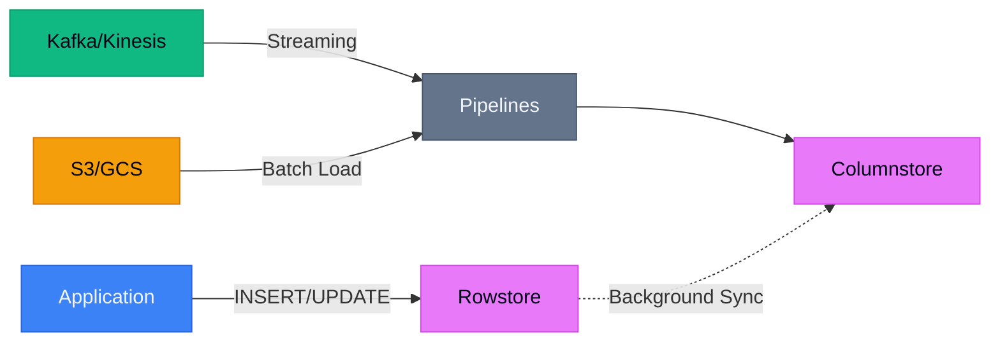
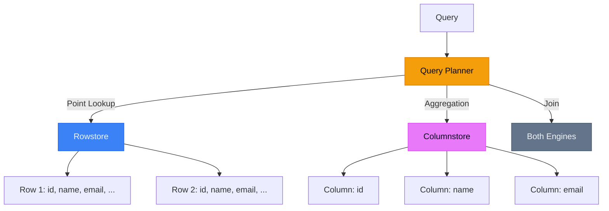
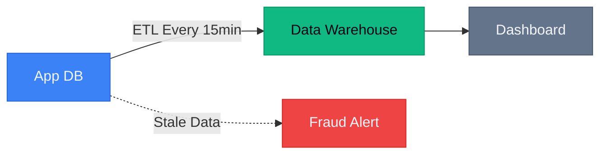
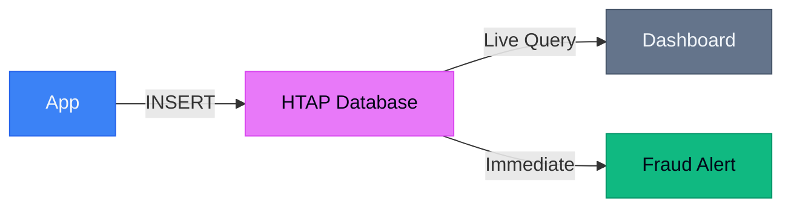
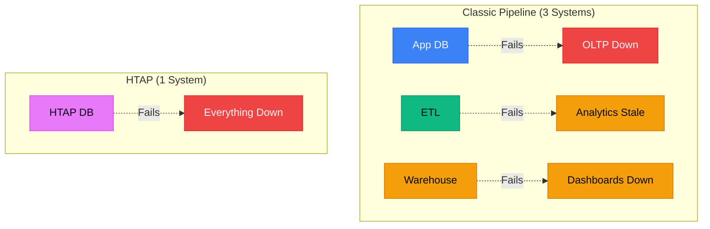

# How SingleStore Handles Real-Time Analytics at Scale (Without the Fairy Dust)

> [!NOTE]
> This post is Part 2 of the **[Distributed SQL Deep Dive](/blog/distributed-sql-series-overview)** series.

## TL;DR

- **"Real-time analytics" is marketing speak**—what you actually want is "fresh enough analytics without breaking OLTP"
- **HTAP (Hybrid Transactional/Analytical Processing) isn't magic**—it's architectural choices with specific trade-offs
- **SingleStore uses dual storage engines**: rowstore for transactions, columnstore for analytics
- **The win isn't speed**—it's operational simplicity (fewer systems, less data movement)
- **Don't use HTAP if**: your analytics can lag by hours, you have <100GB data, or your team can't operate distributed systems

---

## Why "Real-Time Analytics" Is a Misleading Term

Let's be honest: **true real-time analytics doesn't exist at scale**.

What you actually need is:
- **Fresh enough** (seconds to minutes, not hours)
- **Consistent enough** (no phantom reads during dashboards)
- **Fast enough** (queries complete before users rage-quit)

The industry calls this "real-time" because it sounds better than "pretty recent analytics that won't crash your production database."

### What You're Really Solving

**The classic problem:**
1. OLTP database handles transactions
2. ETL job extracts data every hour
3. Data warehouse runs analytics
4. Dashboard shows stale data
5. Business asks: "Why is this 2 hours old?"

**The HTAP promise:**
1. Single database handles both workloads
2. Analytics run on fresh data
3. Transactions don't slow down
4. Fewer systems to operate

Sounds great. Let's talk about how it actually works.

---

## Ingest Paths: Streaming, Batch, and the Hybrid Reality

In production, data arrives in three ways:



### 1. Transactional Writes (Rowstore)

Your application does normal `INSERT`/`UPDATE`/`DELETE` operations.

These hit the **rowstore**:
- Row-oriented storage (like PostgreSQL)
- B-tree indexes
- MVCC for transactions
- Optimized for point lookups and updates

**Latency:** Sub-millisecond  
**Use case:** User-facing transactions

### 2. Streaming Ingest (Pipelines)

High-throughput event streams from Kafka, Kinesis, etc.

These use **pipelines** that write directly to columnstore:
- Batched writes (not row-by-row)
- Compressed columnar format
- Optimized for append-heavy workloads

**Latency:** Seconds (configurable batch interval)  
**Use case:** Event logs, clickstreams, IoT data

### 3. Batch Loads (Bulk Import)

Historical data from S3, GCS, or data lakes.

Uses `LOAD DATA` for bulk import:
- Parallel loading across cluster
- Minimal overhead
- Direct to columnstore

**Latency:** Minutes (depends on data size)  
**Use case:** Backfills, migrations, daily dumps

### The Hybrid Reality

**Most production systems use all three.**

Example: E-commerce fraud detection
- User transactions → rowstore (real-time)
- Clickstream events → streaming pipeline (seconds)
- Historical purchase data → batch load (nightly)

Analytics queries join across all three sources.

---

## Rowstore vs Columnstore: The Operational View

Here's the part vendor docs gloss over: **you're managing two storage engines**.



### When Queries Hit Rowstore

```sql
-- Point lookup: uses rowstore
SELECT * FROM orders WHERE order_id = 12345;

-- Recent data: might use rowstore
SELECT * FROM orders WHERE created_at > NOW() - INTERVAL 5 MINUTE;
```

**Why rowstore wins:**
- Fetching full rows is cheap
- B-tree index lookup is fast
- Data is already in memory (hot cache)

### When Queries Hit Columnstore

```sql
-- Aggregation: uses columnstore
SELECT product_id, SUM(revenue) 
FROM orders 
WHERE created_at > '2026-01-01'
GROUP BY product_id;

-- Scan-heavy: uses columnstore
SELECT AVG(order_value) FROM orders WHERE status = 'completed';
```

**Why columnstore wins:**
- Only reads needed columns (compression helps)
- Vectorized execution (SIMD)
- Parallel scan across partitions

### The Tricky Part: Joins

```sql
-- Join across both engines
SELECT u.email, SUM(o.revenue)
FROM users u
JOIN orders o ON u.user_id = o.user_id
WHERE o.created_at > NOW() - INTERVAL 1 HOUR
GROUP BY u.email;
```

If `users` is in rowstore and `orders` is in columnstore, the query planner must:
1. Decide which side to broadcast
2. Shuffle data across nodes
3. Merge results

**This is where HTAP gets expensive.**

Network I/O becomes the bottleneck, not storage.

---

## Why HTAP Matters: A Concrete Scenario

Let's walk through a real use case: **fraud detection dashboard**.

### Classic Analytics Pipeline



**The problem:**
- Transaction happens at 10:00 AM
- ETL runs at 10:15 AM
- Dashboard updates at 10:20 AM
- Fraud detected at 10:25 AM
- **Fraudster already withdrew funds**

**System count:** 3 (app DB, ETL, warehouse)  
**Failure modes:** ETL job fails, warehouse down, network partition

### HTAP Pipeline



**The win:**
- Transaction happens at 10:00 AM
- Analytics query sees it at 10:00:05 AM (5-second lag)
- Fraud detected at 10:00:10 AM
- **Transaction blocked before completion**

**System count:** 1  
**Failure modes:** Database down (but you'd have replicas)

### The Trade-Off

**You traded:**
- Operational complexity (fewer systems)
- Data freshness (seconds vs minutes)

**For:**
- Higher database load (OLTP + OLAP on same cluster)
- More expensive infrastructure (need headroom for both workloads)
- Tighter coupling (can't scale analytics independently)

**Is it worth it?**

Depends on your SLA for freshness.

---

## Trade-Offs and When NOT to Use HTAP

### Don't Use HTAP If:

**1. Your analytics can lag by hours**

If your dashboard updates daily, you don't need HTAP.

Use:
- PostgreSQL + read replicas
- Nightly ETL to Snowflake/BigQuery
- Save money, reduce complexity

**2. Your data is <100GB**

HTAP databases are designed for scale.

If your entire dataset fits in memory on a single node, you're paying for features you don't need.

Use:
- PostgreSQL with good indexes
- Materialized views for aggregations
- Maybe ClickHouse if you're write-heavy

**3. You can't operate distributed systems**

HTAP databases are distributed by nature.

You need to understand:
- Cluster topology
- Replication lag
- Partition rebalancing
- Network failures

If your team struggles with PostgreSQL replication, HTAP will hurt.

**4. Your workload is purely OLTP or purely OLAP**

HTAP shines when you have **both** workloads.

If you only do transactions: use PostgreSQL  
If you only do analytics: use ClickHouse or BigQuery

Don't pay for hybrid if you don't need hybrid.

---

## Failure Modes: System Count vs Blast Radius



### Classic Pipeline

**Failure isolation:**
- App DB fails → transactions down, analytics still work
- ETL fails → analytics stale, transactions still work
- Warehouse fails → dashboards down, transactions still work

**Blast radius:** Contained

### HTAP

**Failure isolation:**
- Database fails → **everything down**

**Blast radius:** Total

**Mitigation:**
- Run replicas (increases cost)
- Separate read/write workloads (reduces HTAP benefit)
- Accept the risk (if uptime SLA allows)

---

## Decision Checklist

Before choosing HTAP, answer these:

**1. What's your freshness SLA?**
- Seconds → HTAP justified
- Minutes → Maybe HTAP
- Hours → Don't use HTAP

**2. What's your data volume?**
- <100GB → Don't use HTAP
- 100GB-1TB → Consider HTAP
- >1TB → HTAP makes sense

**3. Do you have both OLTP and OLAP workloads?**
- Yes → HTAP might fit
- No → Use specialized database

**4. Can your team operate distributed systems?**
- Yes → Proceed
- No → Stick with simpler tools

**5. What's your budget?**
- HTAP is expensive (compute + storage for both workloads)
- Can you afford headroom for peak load?

**6. What's your tolerance for coupling?**
- HTAP couples OLTP and OLAP
- Scaling one affects the other
- Are you okay with that?

---

## What I'd Do Differently Next Time

### Mistakes I Made

**1. Migrated too early**

We moved to HTAP when our data was 50GB.

We should have:
- Exhausted PostgreSQL first
- Added read replicas
- Used materialized views

**Lesson:** Don't solve future problems with current architecture.

**2. Underestimated operational complexity**

HTAP databases require:
- Monitoring both rowstore and columnstore
- Understanding query plans across engines
- Tuning for mixed workloads

We weren't ready.

**Lesson:** Operational maturity matters more than features.

**3. Ignored the coupling risk**

When analytics queries spiked, OLTP latency suffered.

We had to:
- Add resource limits
- Separate workloads (defeating the purpose)
- Scale the entire cluster (expensive)

**Lesson:** HTAP is a trade-off, not a silver bullet.

### What I'd Do Instead

**Start simple:**
1. PostgreSQL + read replicas
2. Materialized views for common aggregations
3. Monitor freshness SLA

**Migrate when:**
1. Freshness SLA drops below 5 minutes
2. Data exceeds 500GB
3. Team has distributed systems experience
4. Budget supports 2-3x infrastructure cost

**Evaluate alternatives:**
- ClickHouse for pure analytics
- TimescaleDB for time-series
- Separate OLTP + OLAP if coupling is a concern

---

## Key Takeaways

1. **HTAP isn't about speed—it's about operational simplicity**
2. **You're trading system count for blast radius**
3. **Rowstore + columnstore = two engines to understand**
4. **Freshness SLA drives the decision, not data volume alone**
5. **Don't use HTAP if your analytics can lag by hours**

---

## Further Reading

- [SingleStore vs PostgreSQL: When Distributed SQL Actually Wins](/blog/singlestore-vs-postgresql)
- [Debugging Slow Database Queries](/blog/debugging-slow-database-queries)
- [Real-Time Analytics: Trade-offs and Best Practices](/blog/realtime-analytics-tradeoffs)

---

**Running HTAP in production?** I'd love to hear your war stories. [Email me](mailto:connect2shahidmoosa@gmail.com) or connect on [LinkedIn](https://linkedin.com).
