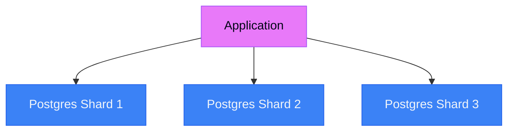
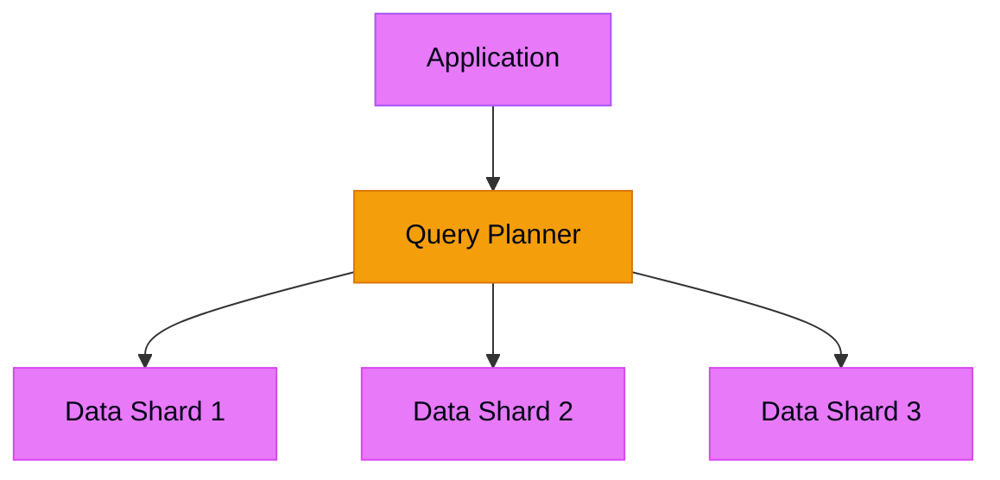
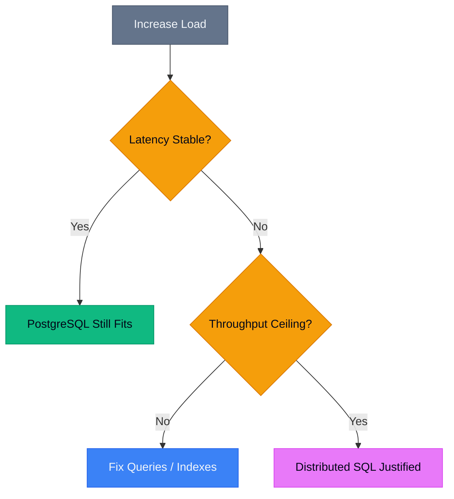

# SingleStore vs PostgreSQL: When Distributed SQL Actually Wins

> [!NOTE]
> This post is Part 1 of the **[Distributed SQL Deep Dive](/blog/distributed-sql-series-overview)** series.

This post is not about which database is "faster."  
It's about when a single-node database stops failing gracefully—and when a distributed one starts paying for itself.

## TL;DR

- **PostgreSQL fails on throughput, not latency**
- **Distributed SQL doesn't make queries faster—it makes them stable under load**
- **If your problem is a missing index, switching databases is self-harm**
- **If your dashboards collapse during traffic spikes, you've hit a structural ceiling**

---

## The Moment Every System Hits

Every growing system reaches a point where performance problems stop being "bad queries" and start being **physics**.

You:
- add indexes
- add read replicas
- tune connection pools

Things improve—until they don't.

That's usually when someone asks:

> "Should we move off Postgres?"

**Most teams ask that too early or too late.**

This post explains how to tell the difference.

---

## Latency vs Throughput: The Trade-Off Most Teams Miss

PostgreSQL is exceptional at low-latency OLTP when:
- concurrency is moderate
- writes are predictable
- reads are selective and indexed

At that scale, a single well-tuned node delivers excellent p95 latency.

**The problem starts when throughput pressure rises.**

Symptoms look familiar:
- WAL fsync pressure under heavy writes
- More indexes → slower writes
- More connections → lock contention
- Analytical queries evict hot OLTP pages

You can keep latency low **or** push more work through the system—but not both forever.

### Latency vs Throughput Curves

```
PostgreSQL (single node):
Concurrency 1-5 → p95 latency: 1ms → 15ms (exponential growth)

Distributed SQL:
Concurrency 1-5 → p95 latency: 2ms → 4ms (linear growth)
```

**Key point:**  
Distributed SQL doesn't magically reduce latency.  
**It preserves predictable latency under load.**

That distinction matters.

---

## Where PostgreSQL Sharding Starts to Hurt

Nobody plans to shard Postgres on day one.

It sneaks up on you:
- multi-tenant tables grow
- you shard by `tenant_id`
- app-level routing handles it
- everything works… until it doesn't

Then the pain shows up:
- **cross-tenant reporting becomes app-side fan-out**
- **schema migrations must coordinate across shards**
- **global constraints quietly disappear**
- **transactions stop meaning what you think they mean**

At that point, you're running a distributed system—**without distributed query planning**.

### App-Level Sharding vs Distributed SQL

**App-Level Sharding:**



**Distributed SQL:**



SingleStore's real advantage isn't raw speed—**it's that cross-partition queries are first-class, not an afterthought**.

---

## What Distributed SQL Actually Buys You

In systems like SingleStore:
- **aggregators plan queries**
- **leaves execute where data lives**
- **joins and aggregations run in parallel**
- **results are merged efficiently**

This matters when:
- queries scan large datasets
- aggregations dominate workload
- freshness matters (seconds, not hours)

If your system needs to answer:

> "What happened across all customers in the last 30 seconds?"

**You're already outside PostgreSQL's comfort zone.**

---

## When SingleStore Is Honestly Overkill

Vendor blogs rarely include this part.

**Do not use distributed SQL if:**
- your workload is <500 TPS
- analytics can lag by minutes or hours
- a read replica + warehouse solves the problem
- your team isn't ready to operate a cluster

Distributed systems tax you in:
- operational overhead
- debugging complexity
- network-related failure modes
- capacity planning mistakes

**If your biggest issue is a missing index, switching databases is self-harm.**

---

## A Concrete Decision Rule (Learned the Hard Way)

Before recommending distributed SQL, I now ask:

1. **Is throughput, not query quality, the bottleneck?**
2. **Do we need cross-partition analytics in real time?**
3. **Will this reduce system count, not add to it?**

If the answer to all three isn't "yes":  
**Postgres usually wins.**

---

## Decision Flowchart



**The decision isn't which is better.**  
**It's where your curve bends.**

---

## What I'd Do Differently Next Time

I wouldn't chase architecture early.

I'd:
- **define hard thresholds** (QPS, data size, freshness)
- **exhaust Postgres properly**
- **treat distributed SQL as an explicit inflection point**

Scaling isn't about tools.

**It's about knowing which problems you actually have.**

---

## Real-World Example: When We Made the Switch

At a previous role supporting a SaaS analytics platform:

**Before (PostgreSQL + app-level sharding):**
- 12 Postgres instances
- Custom routing layer
- Cross-tenant reports took 30-45 seconds
- Schema migrations required downtime windows

**After (SingleStore):**
- 3-node cluster
- Native distributed queries
- Same reports: 2-3 seconds
- Rolling schema changes

**The win wasn't speed—it was operational simplicity.**

---

## When to Stick with PostgreSQL

I still recommend PostgreSQL for:
- **Traditional OLTP workloads** (e-commerce, SaaS apps)
- **Teams without distributed systems experience**
- **Workloads where consistency > throughput**
- **Systems that can tolerate read replica lag**

PostgreSQL is battle-tested, well-understood, and has an incredible ecosystem.

**Don't fix what isn't broken.**

---

## Key Takeaways

1. **Distributed SQL solves throughput ceilings, not bad queries**
2. **App-level sharding is a distributed system without the tooling**
3. **Real-time cross-partition analytics is the killer use case**
4. **Operational complexity is a real cost—budget for it**
5. **Most teams should exhaust PostgreSQL first**

---

## Further Reading

- [Debugging Slow Database Queries](/blog/debugging-slow-database-queries)
- [Real-Time Analytics: Trade-offs and Best Practices](/blog/realtime-analytics-tradeoffs)
- [Getting Started with Distributed Databases](/blog/getting-started-distributed-databases)

---

**Have you hit the throughput ceiling with PostgreSQL?** I'd love to hear about your experience. Reach out on [LinkedIn](https://linkedin.com) or [email me](mailto:connect2shahidmoosa@gmail.com).
